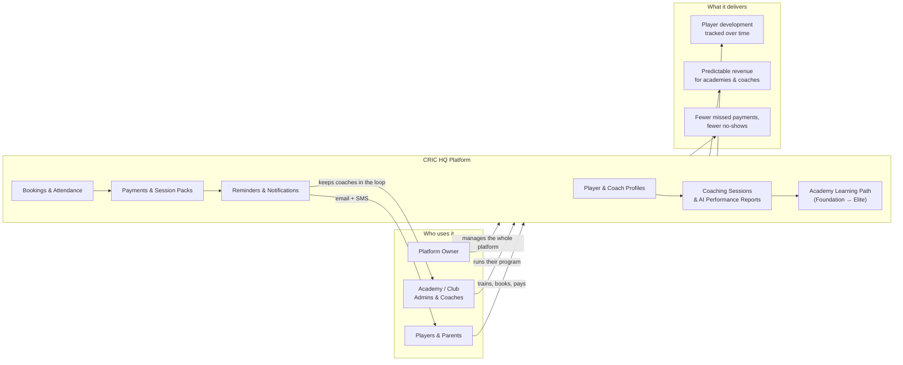

# CRIC HQ — How It All Fits Together

*A plain-language view of the platform, for non-technical audiences.*

## The three-part story

**1. Coaching, made measurable.**
Every session a player attends feeds into an AI-generated performance report — ball speed, technique,
injury-risk flags — plus a structured 4-stage learning path (Foundation → Mechanics → Velocity →
Elite) so players and parents can see real progress, not just attendance.

**2. Running an academy, without the admin headache.**
Academies sell session packs and bookings through the platform. Payments split automatically —
the academy gets paid, the platform takes a small transparent fee — with no manual invoicing.

**3. Payments that chase themselves.**
The platform reminds players by email and text before a payment is due, loops in their coach if
it's urgent, and — only as a last resort — pauses a player's access until it's sorted. Academies
spend less time chasing money and more time coaching.
