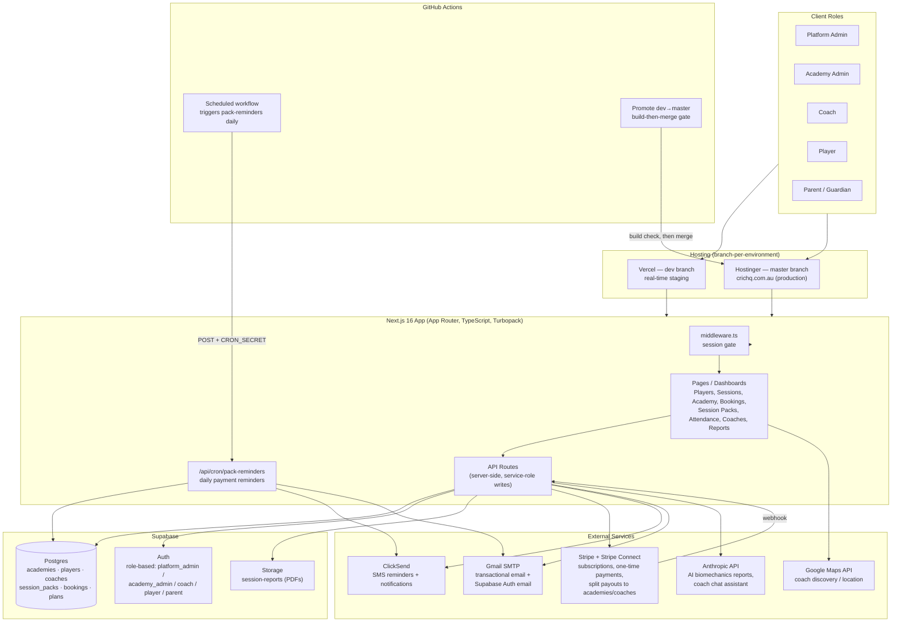

# CRIC HQ — Technical Architecture

> Reflects the system as actually built and deployed (not the original Flutter/FastAPI proposal in
> `PACE_HQ_Complete_Project_Documentation.md`, which describes an earlier planning stage). Built on
> Next.js + Supabase rather than a separate mobile app and Python backend.

## System overview

## Core data domains (Postgres, via Supabase)

| Domain | Purpose |
|---|---|
| `academies`, `coaches`, `players` | Roster, roles, contact info (incl. SMS fallback phone on academies) |
| `session_packs` | Prepaid group-session credit bundles — payment status, due date, agreed weekly schedule |
| `bookings`, `group_sessions`, `group_session_occurrences`, `attendance_records` | Individual bookings vs. recurring group sessions and their weekly attendance |
| `plans` | Plan Catalog — B2C subscriptions (Player Pro, Coach Pro) and B2B org licenses, incl. per-plan platform fee override |
| `reports` | AI-generated biomechanics reports (metrics, injury risk, drill recommendations) |
| `user_requests` | Signup approval queue (platform_admin gated) |

## Payment flow (Stripe Connect)

Session-pack and booking payments split automatically at checkout: the platform keeps a
configurable fee (10% default, overridable per academy via its assigned plan), the remainder
transfers directly to the academy's payout destination (head coach, or the specific coach in
split-payout mode) — no manual reconciliation step.

## Automated payment-reminder pipeline

A single scheduled route (`/api/cron/pack-reminders`), triggered daily by a GitHub Actions
workflow against production only:

1. **7 days out** — email reminder to the player.
2. **2 days out** — second email reminder.
3. **Due today** — email (CC'd to the player's coach, or the academy's own phone/name if no coach
   is assigned) + SMS to both the player and that coach/academy.
4. **Grace period expires (7 days overdue)** — the player's login is disabled, staff are notified
   by email + SMS, and reactivation requires a platform_admin or the player's own academy_admin.

Every step is idempotent (each milestone fires at most once per pack) and every send is
best-effort — an email or SMS failure never blocks the rest of the run.

## Environments

| | Dev | Prod |
|---|---|---|
| Git branch | `dev` | `master` |
| Hosting | Vercel | Hostinger (`crichq.com.au`) |
| Database | Separate Supabase project (cloned schema) | Live Supabase project |
| Stripe | Test mode | Live mode |
| Promotion | — | Manual GitHub Action: builds `dev` as a safety check, then merges into `master` |
